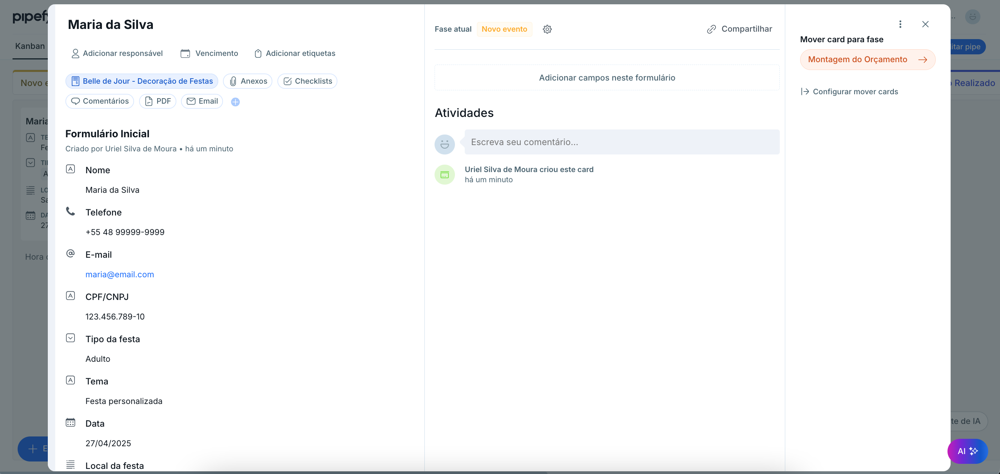
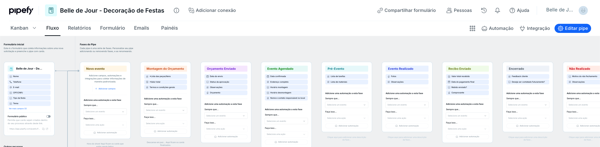
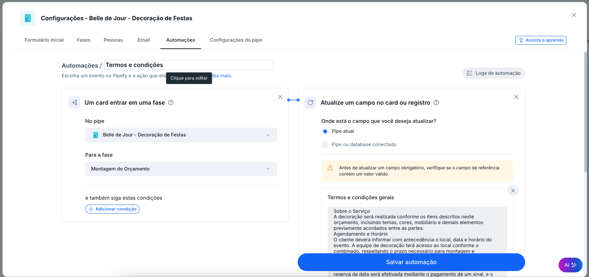
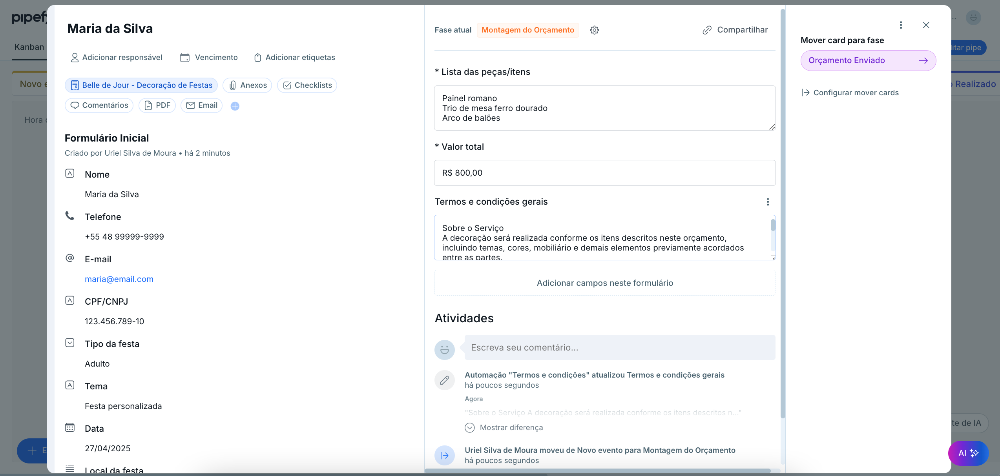
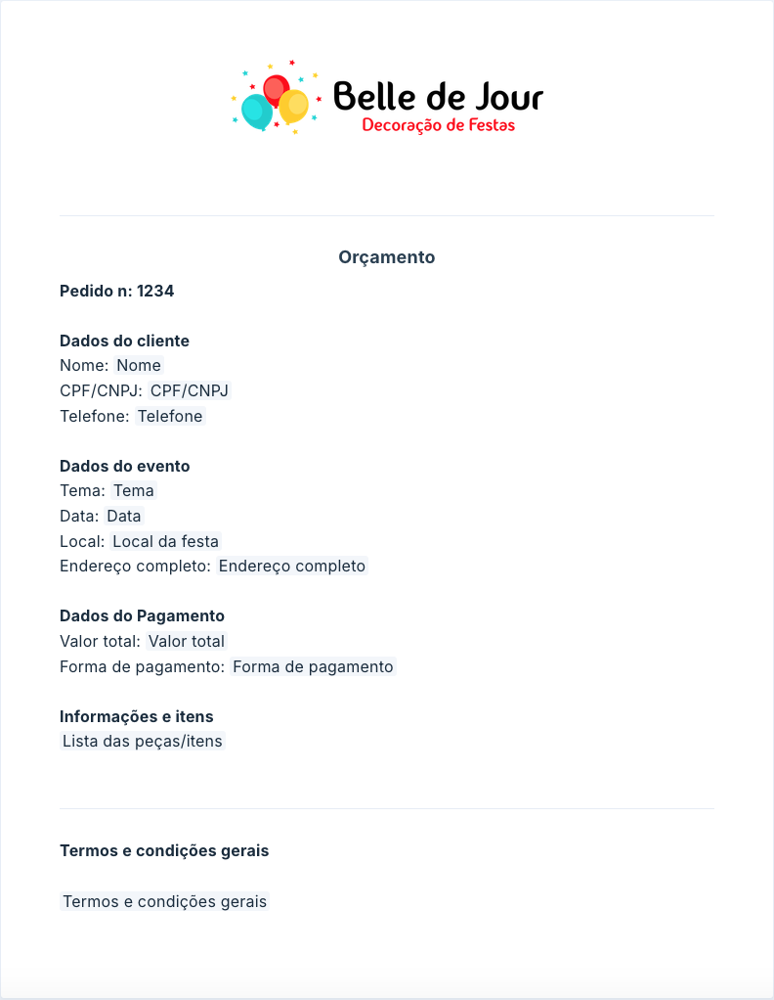
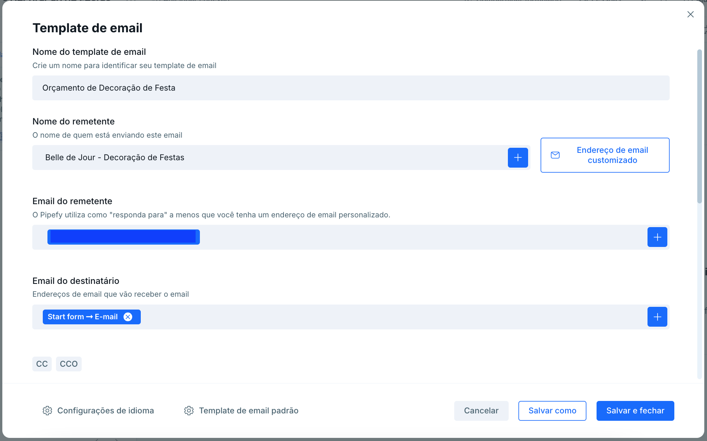
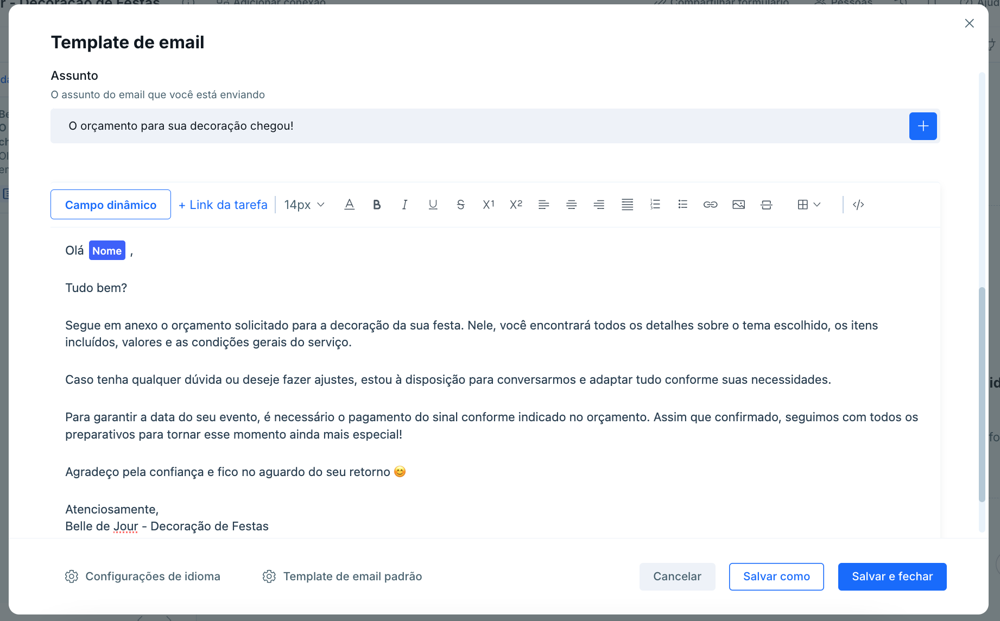
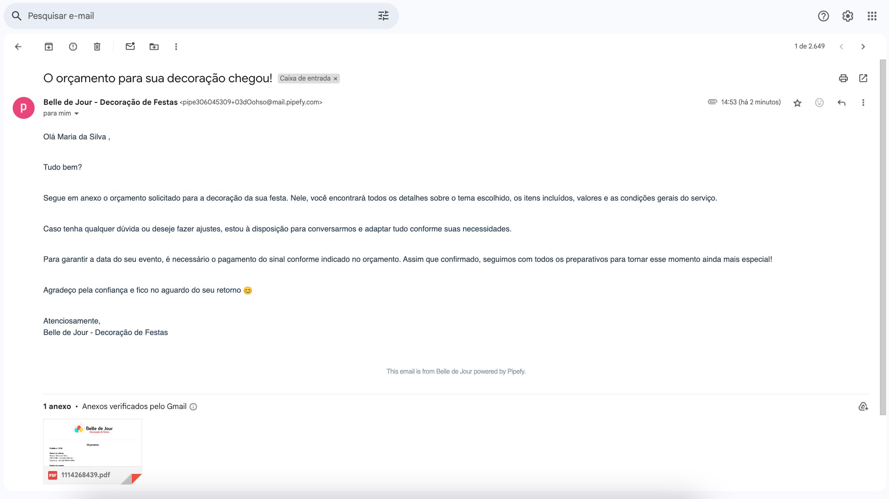

# 🎉 CRM no Pipefy para Gestão de Decoração de Festas

Este projeto foi desenvolvido com o objetivo de estruturar um fluxo completo de CRM no Pipefy, voltado para empresas de **decoração de festas**, centralizando o atendimento ao cliente, orçamentos, envio de propostas e organização interna.

---

## 🚀 Tecnologias Utilizadas

- ✅ [Pipefy](https://www.pipefy.com/) — Plataforma de gestão de processos
- ✅ PDF Generator Pipefy — Para geração automática de documentos
- ✅ E-mails automáticos do Pipefy
- ✅ Automação de preenchimento de campos
---

## 🧩 Funcionalidades do CRM

### 1. 📋 Formulário Inicial
Criação de formulário público personalizado, com campos essenciais para coleta de dados:

- Nome do cliente
- Telefone
- E-mail
- CPF
- Tipo da festa
- Tema
- Data da festa
- Local e observações

🎬 *Preenchimento do Formulário*

📸 *Dados vinculados ao card:*

---

### 2. 🧠 Etapas do Pipe

O Pipe foi estruturado com etapas que representam o ciclo de atendimento:

1. **Novo evento**
2. **Montagem do orçamento**
3. **Orçamento em enviado**
4. **Evento agendado**
5. **Pré-evento**
6. **Evento realizado**
7. **Recibo enviado**
7. **Encerrado**
7. **Não realizado**

📸 *Print das Etapas do Pipe:*

---

### 3. ⚙️ Automação de processo
Automação para pré-preenchimento de campo com termos e condições básicas do contrato:

📸 *Print da automação criada:*

📸 *Print do campo preenchido pela automação:*

---

### 4. 📄 Geração de PDF com Orçamento

Geração automática de PDF com os dados do card, incluindo valores, itens da decoração e condições.

📸 *Print do template do PDF:*

🎬 *PDF Gerado:*

---

### 5. ✉️ Envio de E-mail com Template

Template de e-mail personalizado para envio de orçamento. Inclui:

- Configurações para envio via e-mail nativo Pipefy
- Texto personalizado

📸 *Configurações do template do E-mail:*

🎬 *Fluxo de envio e recebimento do e-mail:*

📸 *E-mail recebido no Gmail:*

---

## ▶️ Como Usar

1. Acesse o Pipefy e replique as etapas e automações descritas.

2. Faça upload dos templates de PDF e e-mail usando os prints como referência.

💡 Considerações Finais

| Este fluxo está pronto para ser utilizado por empresas que desejam profissionalizar sua gestão de eventos. Todos os recursos foram pensados para facilitar a comunicação com o cliente e otimizar o tempo da equipe.

| Desenvolvido com baixa complexidade, o objetivo é proporcionar uma experiência inicial simples e eficiente para o usuário. Como o Pipefy é uma ferramenta totalmente customizável, este fluxo pode ser facilmente escalado e adaptado conforme a demanda e o crescimento do cliente.

📬 Em caso de dúvidas, sugestões ou melhorias, fique à vontade para abrir uma issue ou me contatar via [Linkedin](https://www.linkedin.com/in/urielsilvademoura/).

📌 Projeto criado por Uriel Silva de Moura.

